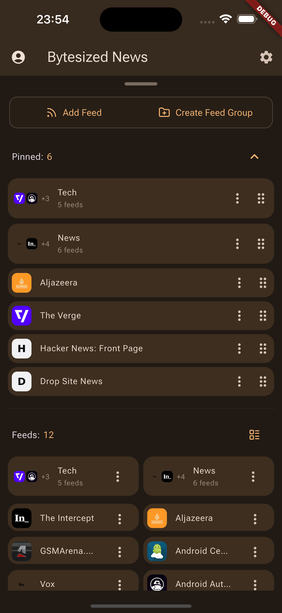

# Bytesized News

Bytesized News is an RSS reader that allows you to read the latest news from your favorite sources in a single place.
With a paid account you can summarize articles with a click of a button (with AI).

The app is built with Flutter and Mobx.

## Features

- Add RSS & ATOM feeds
- Read articles with a built-in browser
- Auto dark mode in web browser
- Ad blocker in web browser
- Summarize articles with AI (paid feature)
- Sort articles by date or title, read or unread, bookmarked
- Bookmark articles
- Create feed groups (folders) to easily organize your feeds and navigate between them
- Curated list of popular feeds (soon)

## Screenshots

### Reader Mode
With AI summary:

Without:

### Feed Manager

### Settings

