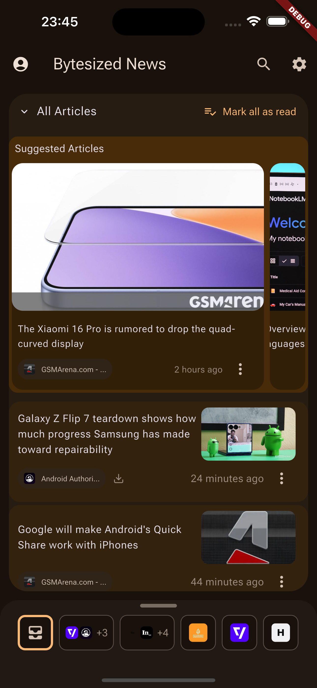
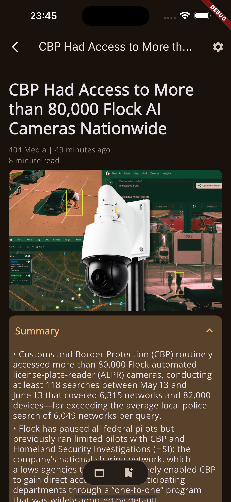
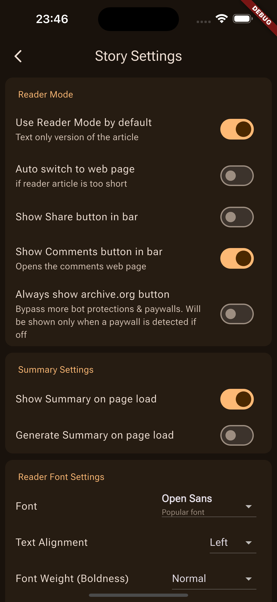
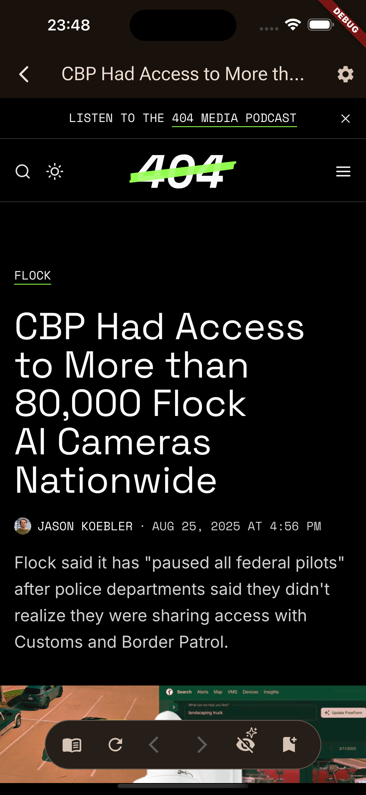
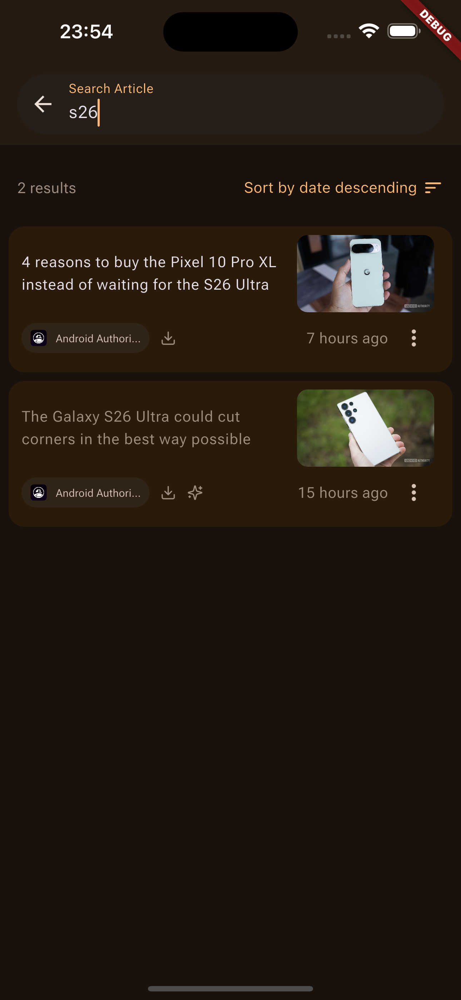
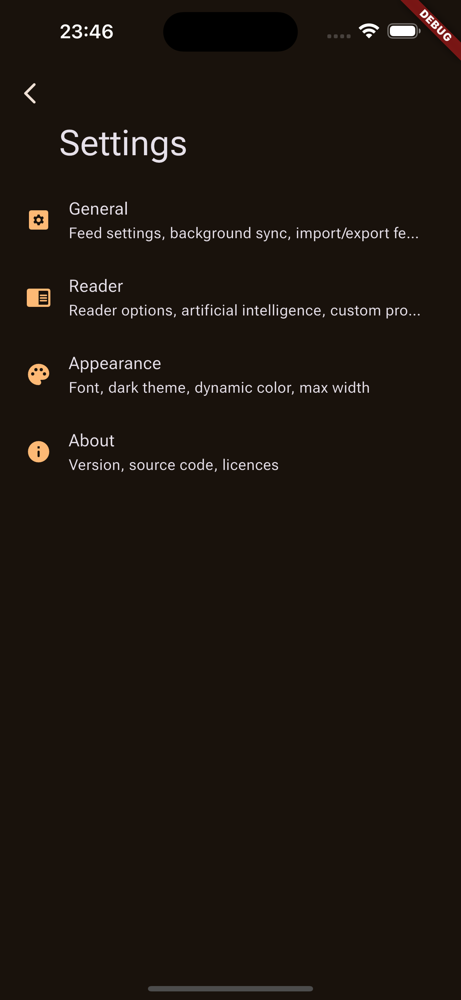

# Bytesized News

Bytesized News is an RSS reader that allows you to read the latest news from your favorite sources in a single place.

The app is built with Flutter and Mobx.

## Features

- Add RSS & ATOM feeds
- Synchronize your feeds and feed groups across all of your devices
- Background fetching for articles (with customizable interval)
- Read articles with a built-in browser
- Auto dark mode in web browser
- Ad blocker in web browser
- Summarize articles with AI (paid feature)
- Get personalized article suggestions based on your reading history
- Sort articles by date or title, read or unread, bookmarked, summarized, downloaded
- Bookmark articles
- Download articles for offline reading
- Create feed groups (folders) to easily organize your feeds and navigate between them
- Curated list of popular feeds

## Screenshots

### Reader Mode
#### With AI summary:

#### Without:

#### Reader mode customization

#### Integrated browser:

### Feed Manager

### Search

### Settings

